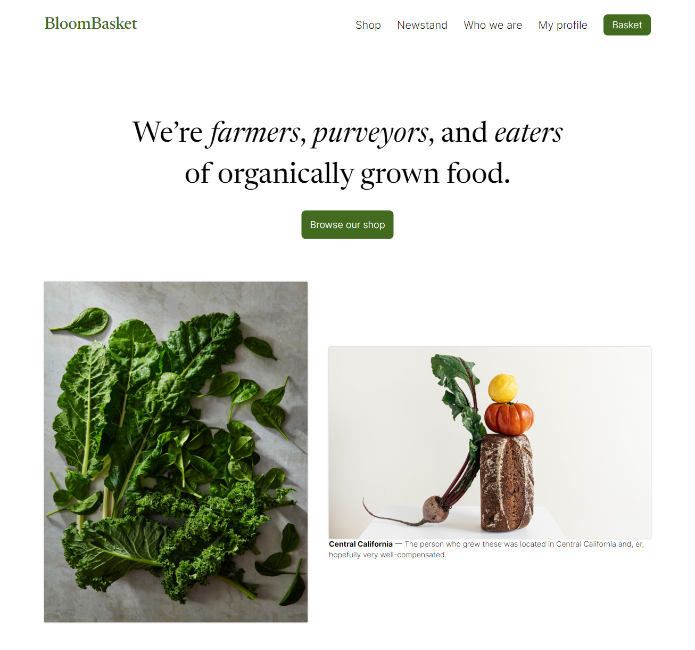
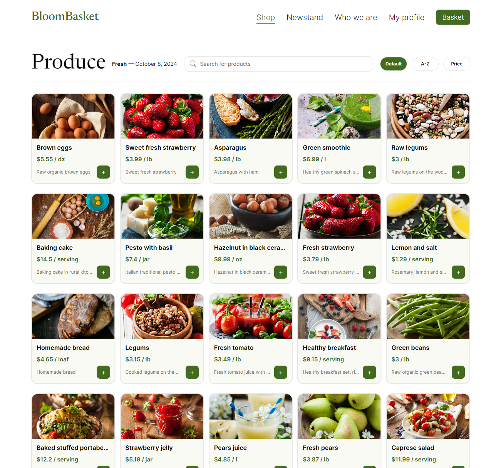
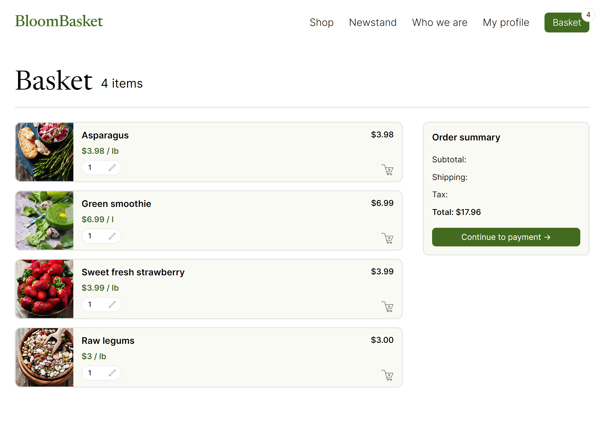
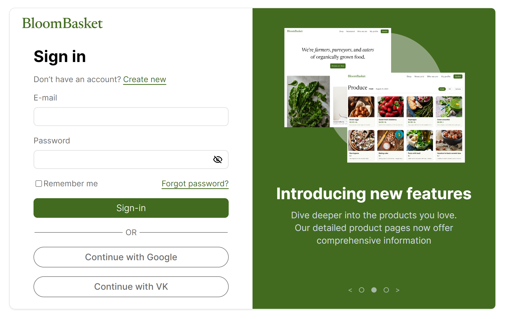

# BloomBasket - online grocery store

Simple E-commerce App Built with React TypeScript.

## This app allows you to:
* Add new products to the cart;
* Change the quantity of products and see the total cost;
* Use search and sort functions;
* Use most of the functionality on the mobile screen;
* Register a new account (under development);
* ...

Please note that the project is still under development. New functionality will be added gradually.

  
  
  
  

## Run Locally
_working on that..._

## Credits
* This project is inspired by the design from the standard Figma guide;
* [supermarket-web-example](https://github.com/wedeploy-examples/supermarket-web-example) for the material (JSON with products, images of these products)
